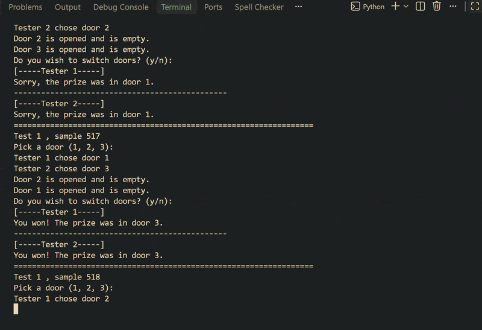
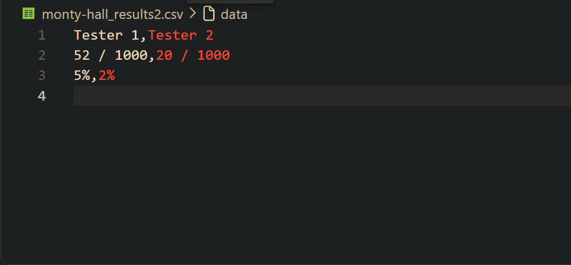

## Monty Hall

The **Monty Hall Problem** is a famous counter-intuitive probability puzzle based on the American television game show ***Let's Make a Deal***.

In the game, a contestant is presented with three doors. Behind one door is a prize, while behind the other two are empty doors. After the player chooses a door, the host, who knows what is behind all three doors, opens one of the remaining two empty doors. The host then asks the player whether they would like to stick with their original choice or switch to the remaining unopened door. 

Mathematically, switching doors doubles the player's chances of winning from 1/3 to 2/3. This can be proven using Bayesian Theorem which I'll update soon enough.

## Calculating Monty Hall: A Bayesian Approach
The informal understanding of Bayesian probability is that the probability of an event is not some fixed, objective quantity. For Bayes, if you start with a prior assumption about the probability of an event, and subsequently receive new information that is pertinent to that event, you should update your understanding about the probability of the event. This notion is formalized in Bayes’ Theorem:
P(A|B) = P(B|A)P(A)/P(B)

Given a prior probability of an event A [P(A)], the posterior probability (updated by new information B) [ P(A|B)] is the prior probability [P(A) ] multiplied by the likelihood of the new information B, given that event A occurs [P(B|A)/P(B)].

Intuitively this approach makes sense, and we perform this type of reasoning every day while navigating our way through life, literally. While walking down a crowded street or driving a car, we are subconsciously assessing and re-assessing the likelihood of events based on a stream of constantly updating information. We are going to take this powerful technique of reasoning and apply it to the Monty Hall problem to see if we can get some clarity into what is going on.

## Calculating the Monty Hall Problem Probabilities
Given the conditions of The Monty Hall Problem:

Let our events be as follows:

A = The event that the car is behind the door chosen by the player.

B = The event that a goat is revealed behind a door not chosen by the player.

Then,

P(A) = 1/3, since there are three doors and one door contains the car.

P(A’) = 2/3, since P(A) + P(A’) = 1 by the definition of the complement of an event.

P(B|A) = P(B|A’) = 1, since a goat behind a door the player hasn’t chosen is always revealed.

Thus formally,

P(B) = P(B|A)P(A) + P(B|A’)P(A’) = 1(1/3) + 1(2/3) = 1

So,

P(A|B) = P(B|A)P(A)/P(B) = 1(1/3)/1 = 1/3 by Bayes’ Theorem.

Since,

P(A|B) + P(A’|B) = 1 by the definition of the complement of an event,

we have P(A’|B) = 1 — P(A|B) = 1 — (1/3) = 2/3.

## Results
We have just shown that the probability of the car not being behind the player’s original door is 2/3, so the optimal strategy in the Monty Hall game is to always change doors. This finding is in line with the simulations we ran above. It seems counter-intuitive that with two doors left in the game the probability for either would be anything other than 50–50, but we must take into account the information we gained when the host opened the door and revealed the goat.
Since P(A|B) = P(A), we see that event B happening did nothing to update the probability of event A. P(A) remains 1/3, and the probability of A’ remains unchanged at 2/3 as well. However, the event A’ has been reduced to the car being behind the remaining door that the player didn’t pick at the start of the game. Thus, the probability that the alternate door contains the car has doubled from 1/3, at the start of the game, to 2/3 because of the new information provided by event B.

## Conclusion
Hopefully this has helped you gain some insight into the Monty Hall Problem and some of math underlying it. I have wrapped the simulation code in a function to make it easy to run multiple tests very quickly. Be forewarned though, for very large numbers of games the function can take a fair bit of time to return a result.

Credit: jeffreyhwatson

