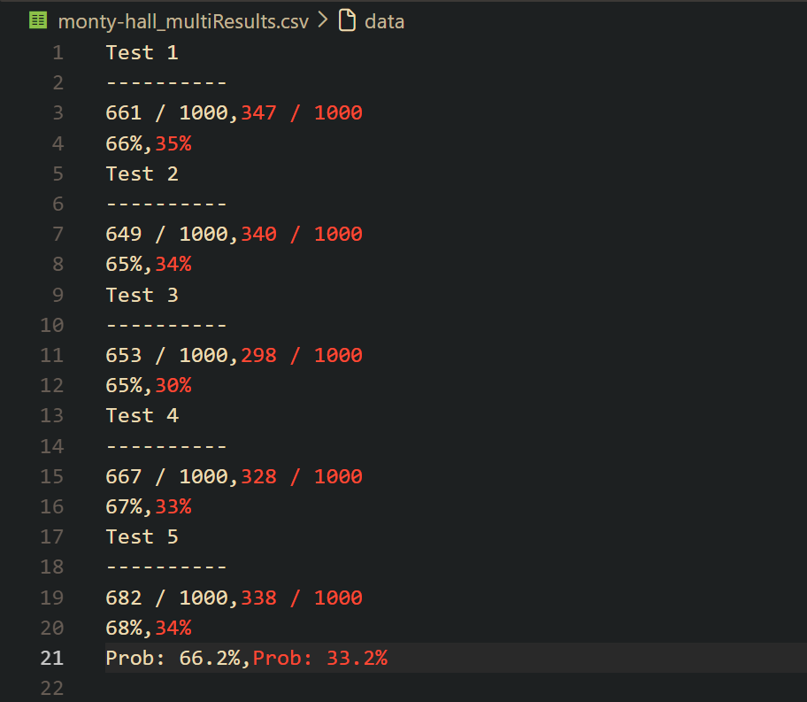

## Monty Hall

The **Monty Hall Problem** is a famous counter-intuitive probability puzzle based on the American television game show ***Let's Make a Deal***.

In the game, a contestant is presented with three doors. Behind one door is a prize, while behind the other two are empty doors. After the player chooses a door, the host, who knows what is behind all three doors, opens one of the remaining two empty doors. The host then asks the player whether they would like to stick with their original choice or switch to the remaining unopened door. 

Mathematically, switching doors doubles the player's chances of winning from 1/3 to 2/3.

https://github.com/user-attachments/assets/f8794a2e-5d6b-4891-8b6b-53d4c03345c5

https://github.com/user-attachments/assets/722f1d29-642d-4637-83f7-b4494373158d

